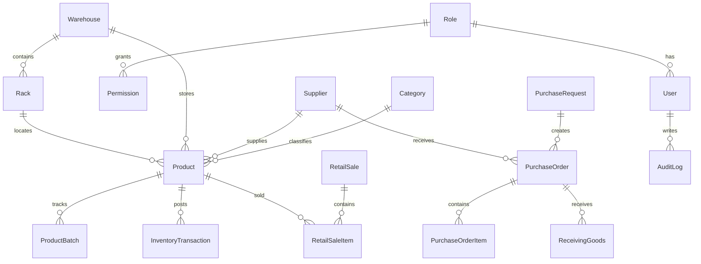

# AR FARM JAYA WMS Architecture

AR FARM JAYA is structured as an enterprise Warehouse Management System using a feature-based Next.js architecture.

## Stack

- Next.js 15 App Router and React 19
- TypeScript
- TailwindCSS with local shadcn-style primitives
- Prisma ORM and PostgreSQL
- Better Auth-ready authentication boundary
- Zustand for client UI state
- TanStack Table for operational data grids
- Recharts for analytics
- React Hook Form and Zod-ready validation

## Application Layers

- `src/app`: route boundaries, server actions, layouts, and module pages.
- `src/components`: reusable UI, shell, dashboard, inventory, and workflow components.
- `src/lib`: domain data, state store, formatting utilities, and validation schemas.
- `prisma`: normalized database schema and seed data.

## Security Model

The database schema includes role based access control via `Role` and `Permission`. Every production mutation should:

1. Authenticate the user through Better Auth.
2. Authorize the user against role permissions.
3. Validate input with Zod.
4. Execute Prisma inside a transaction when stock, purchase, receiving, POS, or distribution data changes.
5. Write an `AuditLog` row with actor, entity, old value, new value, and IP address.

## Operational Modules

- Dashboard
- Inventory Management
- Categories
- Suppliers
- Warehouses
- Rack Management
- Purchase Request and Purchase Order
- Receiving Goods
- Inventory Transactions
- Distribution
- Request Goods
- Stock Opname
- Retail POS
- Reports
- Weekly Field Report (Laporan Pelaksanaan Mingguan)
- Fish Pond Farming (Budidaya Lele)
- Users and Roles
- Notifications
- Audit Log
- Dashboard Analytics

## API Architecture

Use Next.js Server Actions for validated mutations close to the UI. For external integrations, add REST handlers under `src/app/api/*` with the same service layer and validation schemas.

Recommended production services:

- `InventoryService`: FIFO/FEFO allocation, batch tracking, stock mutation ledger.
- `PurchaseService`: PR, PO, approval, supplier performance.
- `ReceivingService`: barcode scan, batch capture, expiry capture, stock update.
- `DistributionService`: picking, packing, loading, shipping, delivery confirmation.
- `RetailService`: POS payment flow, receipt generation, automatic stock deduction.
- `AuditService`: immutable audit log writer.
- `FieldReportService`: weekly implementation reports, report profiles (letterhead + print format), activity photos.

## Weekly Field Report Module

`/weekly-report` generates the printable *Laporan Pelaksanaan Mingguan* used by field programs.

- `ReportProfile` holds everything about presentation: letterhead (logo, organization, tagline, program, contact), accent color, report title, visible table columns, minimum blank rows, signature and approver blocks, and footer notes. Multiple profiles can coexist, so one system serves several programs or partner organizations.
- `WeeklyReport` holds the data: executor, farmer group, location, week/period, sign place and date, and the `WeeklyActivity[]` rows (date, activity, purpose, HST age, amount, output, photo).
- `src/components/report/weekly-report-document.tsx` renders both the on-screen preview and the print output from the same component, so what is previewed is what is printed.
- Printing renders the document through a React portal into `document.body` (`#report-print-area`) and toggles `body.printing-report`, which hides the application layout with `display: none` — that keeps the PDF free of blank pages. `printDocument()` injects the `@page` rule (A4 landscape, 10 mm margins) for the duration of the print, and `fitPrintZoom()` measures the document at the real print width to pick a `zoom` factor that keeps it on one page.
- Photos are downscaled in the browser (`compressImage`) before being stored as data URLs, keeping the persisted store within localStorage limits.

## Fish Pond Farming Module (Budidaya Lele)

`/lele` is a self-contained aquaculture (catfish) monitoring area, separated in the
sidebar under its own "Budidaya Lele" group so the farming business is one click away
from the agriculture/warehouse side.

Data model (all synced to the shared Postgres workspace like the rest of the app):

- `Pond` — a physical pond with a unique code (e.g. "A12"), type (Terpal/Tanah/Beton/Bioflok), and area. Reused across many cycles.
- `FishCycle` — one stock-to-harvest cycle on a pond: stock date, seed source, initial count, seed/other cost, target weight/date, status.
- `PondDailyLog` — daily entry per cycle: feed kg + cost, deaths, optional weight sampling.
- `PondHarvest` — partial or final harvest: count, weight, price/kg, revenue, buyer.

`src/lib/lele.ts` computes live metrics (age, current live count, survival rate, total
feed, biomass estimate, running P&L, FCR, and a feeding recommendation from a
percent-of-biomass table that decreases with age). Pages: `/lele` (monitoring grid +
pond detail modal with daily input, harvest, and P&L), `/lele/kolam` (pond CRUD + stock a
cycle + finished-cycle history), and `/lele/simulator` (single-cycle business projection:
harvest, feed need, cost, revenue, profit, HPP, BEP, ROI, and a feed-phase guide).

## ERD

