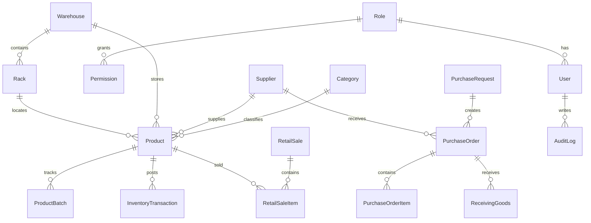

# AR FARM JAYA WMS Architecture

AR FARM JAYA is structured as an enterprise Warehouse Management System using a feature-based Next.js architecture.

## Stack

- Next.js 15 App Router and React 19
- TypeScript
- TailwindCSS with local shadcn-style primitives
- Prisma ORM and PostgreSQL
- Better Auth-ready authentication boundary
- Zustand for client UI state
- TanStack Table for operational data grids
- Recharts for analytics
- React Hook Form and Zod-ready validation

## Application Layers

- `src/app`: route boundaries, server actions, layouts, and module pages.
- `src/components`: reusable UI, shell, dashboard, inventory, and workflow components.
- `src/lib`: domain data, state store, formatting utilities, and validation schemas.
- `prisma`: normalized database schema and seed data.

## Security Model

The database schema includes role based access control via `Role` and `Permission`. Every production mutation should:

1. Authenticate the user through Better Auth.
2. Authorize the user against role permissions.
3. Validate input with Zod.
4. Execute Prisma inside a transaction when stock, purchase, receiving, POS, or distribution data changes.
5. Write an `AuditLog` row with actor, entity, old value, new value, and IP address.

## Operational Modules

- Dashboard
- Inventory Management
- Categories
- Suppliers
- Warehouses
- Rack Management
- Purchase Request and Purchase Order
- Receiving Goods
- Inventory Transactions
- Distribution
- Request Goods
- Stock Opname
- Retail POS
- Reports
- Users and Roles
- Notifications
- Audit Log
- Dashboard Analytics

## API Architecture

Use Next.js Server Actions for validated mutations close to the UI. For external integrations, add REST handlers under `src/app/api/*` with the same service layer and validation schemas.

Recommended production services:

- `InventoryService`: FIFO/FEFO allocation, batch tracking, stock mutation ledger.
- `PurchaseService`: PR, PO, approval, supplier performance.
- `ReceivingService`: barcode scan, batch capture, expiry capture, stock update.
- `DistributionService`: picking, packing, loading, shipping, delivery confirmation.
- `RetailService`: POS payment flow, receipt generation, automatic stock deduction.
- `AuditService`: immutable audit log writer.

## ERD

